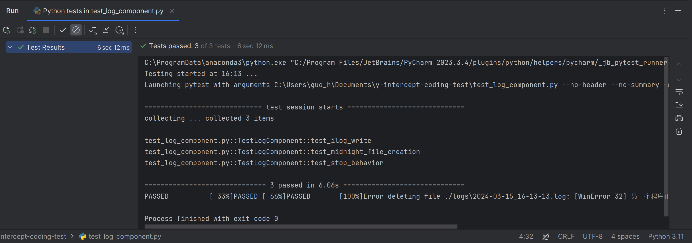

# y-intercept-coding-test
**Name**: Peter Guo Hansheng

**Email**: peter.hansheng.guo@gmail.com

The log component is implemented in Python with libraries including `threading` and `queue` to enable asynchronous logging.
## fold structure
* y-intercept-coding-test
  * **logs/**: folder to store the output log files
  * **resources/**: resources for README
  * **LogComponent.py**: the implementation of the log component
    * **AsyncLogWriter** Class: asynchronous log writer
    * **ILog** Interface: the interface to use the logger
  * **Application.py**
    * Use sample of ILog
  * **test_log_component.py**: Unit testing
    * test_ilog_write: test the basic writing function
    * test_midnight_file_creation: test midnight new file creation
    * test_stop_behavior: test the stop behavior
## Design
### AsyncLogWriter Class
* **Inherits from threading.Thread**:
  * The AsyncLogWriter is a subclass of Thread to allow logging operations to run in a separate thread from the main application
* **Thread-safe Queue**:
  * A Queue is used to store log messages. This ensures that communication between the main thread (application) and the log writer thread is thread-safe.
* **Logging Loop**:
  * The run method contains the main loop that continuously checks for new log messages and writes them to the file.\

### ILog Interface
* Initialization:
  * The ILog class initializes an AsyncLogWriter instance and starts its thread. This separates the logging infrastructure from the application logic.
* Write Method:
  * The write method of the ILog class is a simple pass-through to the AsyncLogWriter's write method. It adds the message to the queue for asynchronous writing.
* Stop Method:
  * The stop method allows the application to stop the logging in two ways, as per requirement. 
  * With wait=False, it quickly empties the queue and stops the logging thread, discarding unwritten log messages.
## Unit Tests
All three tests are passed under Python 3.11 and Windows 11.
